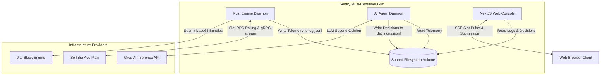
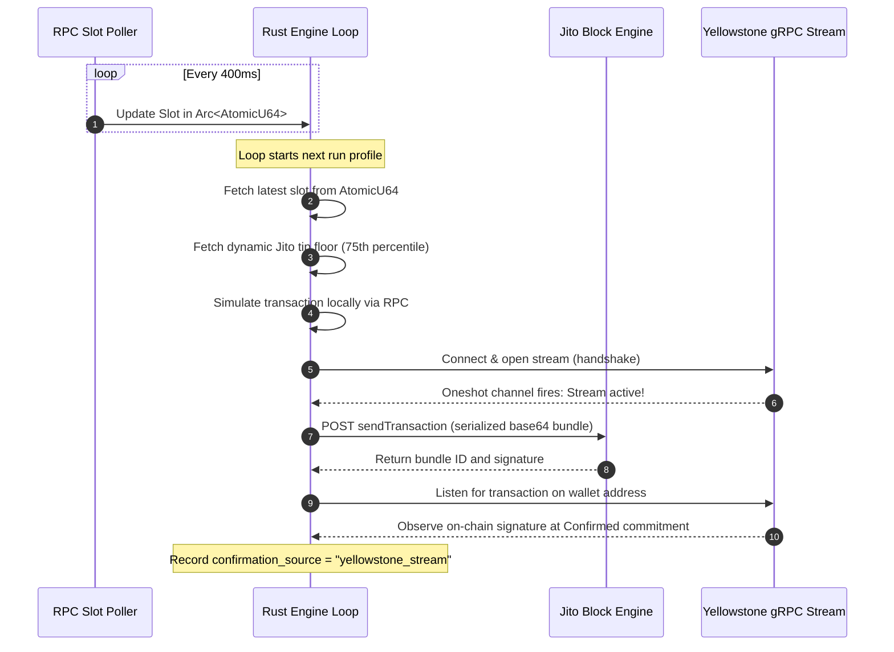
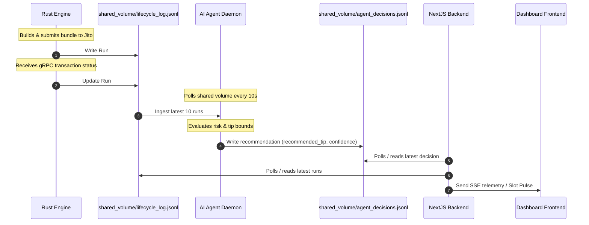

# Architecture & System Design

This document explains the technical architecture, key components, data flow, infrastructure decisions, failure handling, and AI agent logic for **Sentry**, a smart transaction stack built for Solana.

---

## Table of Contents
1. [System Architecture](#1-system-architecture)
2. [Key Components](#2-key-components)
3. [Data Flow Between Services](#3-data-flow-between-services)
4. [Infrastructure Decisions](#4-infrastructure-decisions)
5. [Failure Handling Strategy](#5-failure-handling-strategy)
6. [AI Agent Responsibilities](#6-ai-agent-responsibilities)
7. [Memory Management & Leak Prevention](#7-memory-management-&-leak-prevention)
8. [Dependency Directory](#8-dependency-directory)

---

## 1. System Architecture

### 1.1 Overview
Sentry is a high-performance transaction execution pipeline with real-time network awareness and intelligent decision-making. It utilizes a hybrid Solana gateway (combining Yellowstone gRPC streams for microsecond-precision transaction confirmation with high-frequency RPC slot polling), leverages Jito Bundles at the execution layer for optimal transaction package submission, and uses a decoupled AI Agent as the brain to analyze failures, tune transaction parameters dynamically, and orchestrate self-healing retries. 

These layers form a closed-loop system: Observe (Yellowstone gRPC + RPC Slot Poller) → Decide (AI Agent Policy + LLM Chain) → Execute (Rust Jito Bundle Builder) → Monitor (Multi-stage lifecycle tracking) → Self-Heal (Auto-retry loop).

### 1.2 System Architecture Diagram

---

## 2. Key Components

### 2.1 Rust Engine (`engine/`)
The Rust Engine is the core high-performance execution layer, written in Rust for zero NAPI compilation overhead and multi-threaded reliability.
* **`main.rs`**: Entry point. Boots the engine, spawns the background slot RPC poller, orchestrates the bundle loop, triggers Yellowstone streams, and manages automatic retries.
* **`config.rs`**: Decodes and loads environment configurations via `dotenv`, validating wallet balance requirements (minimum 50,000 lamports enforced on startup).
* **`geyser.rs`**: Configures the Yellowstone gRPC client. Opens a gRPC subscription request filtered by the operator's wallet `account_include` address, using a Tokio `oneshot` synchronization channel to notify when the stream handshake is complete.
* **`jito.rs`**: Fetches active Jito validator accounts via `getTipAccounts`, queries Jito's dynamic tip floor API, simulates transactions locally, constructs the memo + tip bundle, and serializes the signed transaction in base64.
* **`lifecycle.rs`**: Implements the multi-stage confirmation poller (`track_bundle`), polling Solana RPC `getSignatureStatuses` and Jito `getInflightBundleStatuses` concurrently to record execution timestamps.

### 2.2 AI Agent Layer (`agent/`)
An autonomous background observer written in Node.js/TypeScript.
* **State Analyzer (`index.ts`)**: Ingests the JSONL log from the shared volume, computes sliding-window statistics (landed rate, latency, failure stages), and applies a deterministic rule policy.
* **Groq LLM Chain**: Forwards the local policy decision and raw network state to a Groq chat completion API (using `llama-3.3-70b-versatile` or fallbacks) to check safety bounds, audit tip floors, and output a validated JSON action structure.

### 2.3 Dashboard Console (`app/` & `lib/`)
* **Next.js Server (`lib/observatory.ts`)**: Parses shared logs, handles dynamic tip APIs, and compiles transaction bundles for manual console submissions.
* **Web UI Component (`app/page.tsx`)**: Exposes SSE routes for live slot pulsing and progress streams, rendering real-time metrics, lifecycle progress, and the AI agent reasoning panel.

---

## 3. Data Flow Between Services

### 3.1 Main Flow: Slot Detection → Window Validation → Bundle Submission

### 3.2 Transaction Lifecycle Tracking Flow

---

## 4. Infrastructure Decisions

### 4.1 Why Rust for the Core Transaction Engine?
Solana slots update every 400 milliseconds, and block space is highly contested. Pure JavaScript/TypeScript engines introduce garbage collection pauses, NAPI native compilation friction, and slower serialization. By using Rust, Sentry guarantees near-zero latency overhead for cryptographic signing, transaction simulation, and gRPC stream handling, ensuring the transaction lands within the Jito leader schedule window.

### 4.2 Optimizing for the SolInfra Ace Plan Limit (1 Concurrent Stream)
The SolInfra Ace Plan restricts the stack to **1 concurrent gRPC stream**. Attempting to stream slot updates and watch transaction confirmations over separate gRPC connections causes stream exhaustion, drops, and timeouts. 

Sentry resolves this by **offloaded slot updates to a high-frequency (400ms) RPC poller** querying `getSlot` at `Processed` commitment. This preserves the single gRPC stream slot exclusively for transaction confirmation subscriptions, guaranteeing stream-based confirmations on every run.

### 4.3 Why Open the Geyser Stream Before Submission?
gRPC handshakes and filter propagation take 1 to 3 seconds over TLS. If a Jito bundle lands on Solana within 2 to 3 seconds of submission, opening the Geyser stream *after* submission introduces a race condition: the transaction lands before the stream is active, and since Geyser does not play back historical events, the landing is missed. Sentry pre-establishes the gRPC stream *before* calling Jito and uses a Tokio `oneshot` channel to proceed once the stream is ready.

### 4.4 Regional Network Advantage: AMS vs NYC/FRA
During on-chain testing, telemetry revealed that deploying Sentry near **Amsterdam (AMS)** yielded significantly lower Yellowstone transaction observation latencies compared to New York (NYC) or Frankfurt (FRA). This regional speed advantage minimizes the window between `Processed` and `Confirmed` blocks and ensures gRPC streams connect faster.

---

## 5. Failure Handling Strategy

### 5.1 Failure Matrix

| Failure Type | Trigger Condition | Automated Resolution | AI Agent Involvement |
|---|---|---|---|
| `zero_tip` | Jito bundle tip is set to 0 | Engine rejects submission locally, logs error | Yes (recommends tip increase) |
| `blockhash_expired` | Stale blockhash is used, simulation fails | Fetch fresh blockhash, rebuild, and retry | Yes (increases retry priority) |
| `rate_limit_exhausted` | Jito HTTP status 429 is received | Retry with exponential backoff (2s, 4s, 6s, 8s) | Yes (recommends hold if persistent) |
| `jito_rejection` | Invalid bundle structure or signatures | Logs Jito block engine rejection details | Yes (logs fail reason) |
| `confirmation_timeout` | No landing confirmed after 58 seconds | Triggers fallback RPC tracker | Yes (audits for network dropouts) |
| `stream_disconnected` | Network drop at Yellowstone gRPC layer | Re-establishes connection using backoff | None (handles at transport layer) |

### 5.2 Automatic Retry Control Loop
If a non-intentional failure occurs during execution, the engine runs an autonomous recovery loop:
1. Re-queries Solana RPC for a fresh `getLatestBlockhash`.
2. Queries the Jito tip floor API to recalculate a competitive percentile tip.
3. Re-signs and serializes the new transaction.
4. Resubmits the bundle to Jito.
5. Logs the retry as a separate JSONL entry, marking the original's `recovery` field.

---

## 6. AI Agent Responsibilities

### 6.1 Two-Tier Decision Architecture
To keep the core Rust transaction engine fast, Sentry completely separates AI reasoning into an asynchronous TypeScript daemon:
1. **Tier 1 (Deterministic Rules)**: Calculates sliding-window stats (success rate, average latency, failure patterns) to determine baselines (e.g. action: `hold` if success rate < 30%).
2. **Tier 2 (Groq LLM Chain)**: Forwards the baseline decision and network logs to Groq (`llama-3.3-70b-versatile`) as context. The LLM performs a cognitive audit against safety constraints and outputs the final JSON instruction.

### 6.2 Fail-safe Model Cascading
If the primary LLM model fails, the agent automatically attempts connection to fallback models in sequence to prevent stack blockage:
`openai/gpt-oss-120b` → `llama-3.3-70b-versatile` → `llama-3.1-8b-instant` → `local-policy` (fallback: true)

### 6.3 Security Design: Key Isolation
>[!IMPORTANT]
> The AI Agent operates entirely on metadata. Under no circumstances are private keys, keypair bytes, or raw transaction buffers sent to the Groq API or external AI servers. Transaction signing is done strictly locally inside the Rust Engine and Node.js server using private key arrays stored in the local `.env` environment variables.

---

## 7. Memory Management & Leak Prevention

* **Atomic Registers**: Sentry uses a lock-free `AtomicU64` register for slots, ensuring the latest slot update simply overwrites the old value, preventing slot queue memory build-ups.
* **Periodic Cleanup**: In the Next.js console backend, the `TransactionTracker` maintains a 5-minute cleanup interval using `setInterval().unref()` to prune unconfirmed signatures from memory, preventing memory leaks in long-running dashboard processes.
* **LIFO Telemetry**: Telemetry queries are kept to the last 10 entries using array slicing (`runs.slice(0, 10)`), preventing memory bloat during infinite loops.

---

## 8. Dependency Directory

### 8.1 Rust Engine Crate Dependencies
* `yellowstone-grpc-client` (v12.1.0): gRPC client for Yellowstone validator streams.
* `yellowstone-grpc-proto` (v12.1.0): Protobuf definitions for Geyser messages.
* `solana-sdk` (^2.1): Transaction signing and cryptographic serialization.
* `solana-rpc-client` (^2.1): RPC communication with Solana mainnet.
* `tokio` (v1.0): Multi-threaded asynchronous runtime.
* `tonic` (v0.14): Transport engine for gRPC streams.
* `reqwest` (v0.12): High-frequency slot polling client.

### 8.2 Node.js / TypeScript Dependencies
* `next` (v16.2.6): Web dashboard engine and API routes.
* `@solana/web3.js` (^1.98.4): Mainnet Solana library (locked for Jito compatibility).
* `ws` (^8.18.3): Server-Sent Events (SSE) websocket communication.
* `tsx` (^4.19.0): Low-overhead execution wrapper for the agent daemon.
