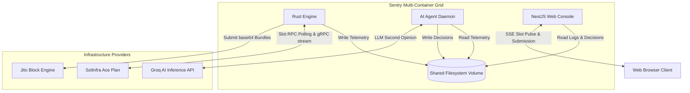
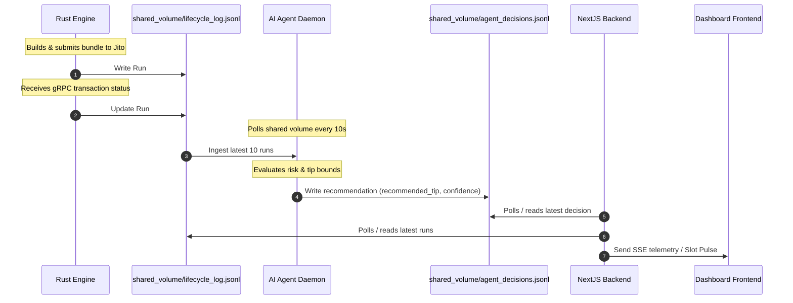
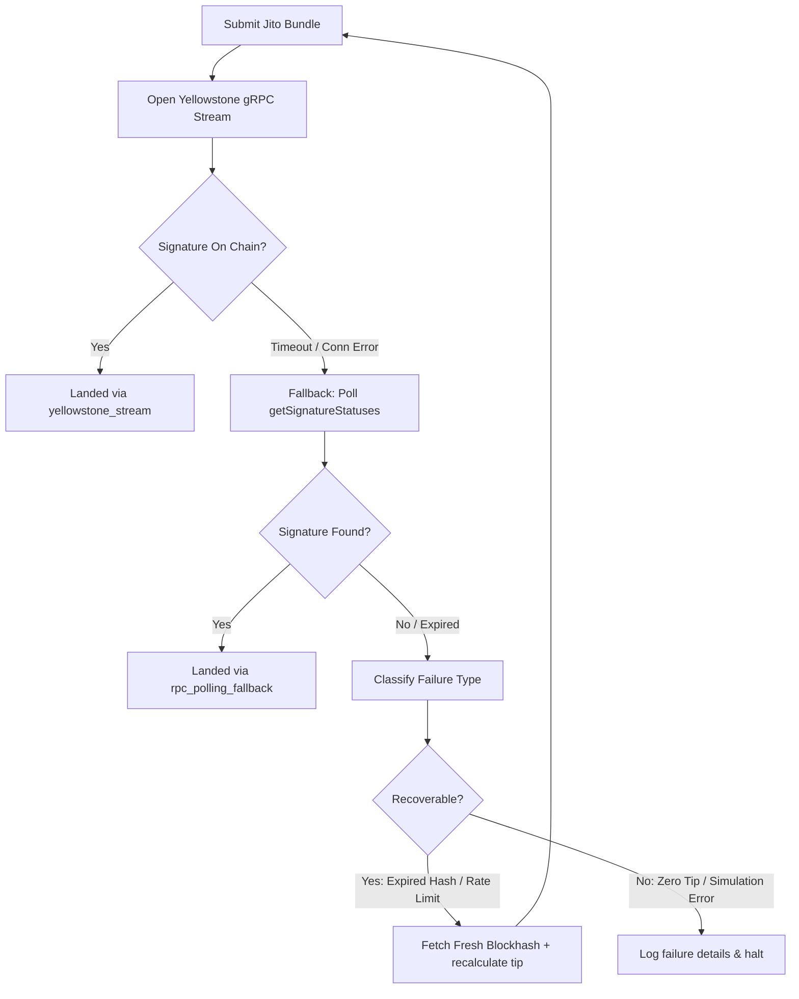

# Architecture & System Design

This document explains the technical architecture, key components, data flow, infrastructure decisions, failure handling, and AI agent logic for **Sentry**, a smart transaction stack built for Solana.

---

## 1. System Architecture

Sentry is built as a decoupled, multi-service architecture communicating through a shared data layer. This design ensures that compute-heavy AI reasoning, low-latency transaction handling, and client-facing web UIs do not block each other.

---

## 2. Key Components

Sentry consists of four decoupled services:

1. **Rust Engine (`engine/`)**: High-performance backend daemon responsible for Jito bundle construction, SolInfra slot RPC polling, Yellowstone gRPC transaction status monitoring, and auto-retry execution.
2. **AI Agent Daemon (`agent/`)**: Autonomous monitoring service built with Node.js/TypeScript that processes historical runs, applies a local deterministic rules policy, and leverages LLM inference chains to make dynamic tip adjustments.
3. **Next.js Web Console (`app/`)**: Full-stack web dashboard that exposes SSE (Server-Sent Events) streams for live slot pulses, lets users trigger bundles, displays running telemetry, and exports evidence records.
4. **Docusaurus Site (`docs/`)**: Developer handbook documenting the configuration, endpoints, failure recoveries, and operational characteristics of the stack.

---

## 3. Data Flow Between Services

Sentry leverages a filesystem-based communication bus inside a shared Docker volume (`sentry-data`). This ensures standard file operations act as a highly performant message queue.

### Flow Details:
* **The Telemetry Stream**: The Rust engine writes structured JSONL entries representing `BundleRun` logs.
* **The Agent Decision Loop**: The AI Agent polls `lifecycle_log.jsonl`, calculates sliding-window performance metrics, determines tip premiums, and appends to `agent_decisions.jsonl`.
* **Real-time Console Stream**: Next.js uses an SSE route to stream new slot events directly to the dashboard, and a dashboard polling API reads logs and decisions out of the shared volume.

---

## 4. Infrastructure Decisions

### Provider Selection: SolInfra & Jito Block Engine
* **SolInfra**: Acts as our core Solana gateway, providing high-speed RPC nodes and Yellowstone gRPC stream endpoints.
* **Jito Block Engine**: Provides flash-loan and MEV bundle submission routes, protecting Sentry transactions from frontrunning and public mempool reorder risks.

### Optimizing for the SolInfra Ace Plan Limit
The SolInfra Ace Plan restricts developers to **1 concurrent gRPC stream**. A standard implementation would consume this stream for slot tracking, leaving no capacity to subscribe to transaction confirmations.

To resolve this limitation:
1. **Offloaded Slot Polling**: Slot tracking is offloaded to a high-frequency (400ms) Solana RPC poll loop (`getSlot`) operating at `Processed` commitment.
2. **Dedicated gRPC Streaming**: The single available gRPC stream is reserved **exclusively** for transaction status subscriptions (`SubscribeRequestFilterTransactions`) mapped in `geyser.rs`.
3. **Outcome**: Sentry conforms to stream-based confirmation requirements on every run without exceeding plan quotas.

---

## 5. Failure Handling Strategy

Solana infrastructure is subject to frequent congestion, blockhash expiries, and variable validator schedules. Sentry implements a multi-layered fallback and classification framework.

### Core Recovery Mechanisms:
* **Connection Race Prevention**: gRPC streams take 1-3 seconds to complete TLS handshakes. If a transaction lands faster than the handshake, the event is missed. Sentry opens the stream *before* submitting the transaction and synchronizes execution using Tokio `oneshot` channels.
* **Stream Fallback**: If the gRPC connection drops, the engine immediately falls back to `getSignatureStatuses` RPC polling (`rpc_polling_fallback`).
* **Autonomous Retry Loop**: When a recoverable failure occurs (such as a blockhash expiration), the engine refreshes the blockhash, queries the Jito tip floor API, rebuilds the transaction, and executes resubmission.

---

## 6. AI Agent Responsibilities

The Sentry AI Agent acts as an autonomous risk auditor and resource controller, separating dynamic tip reasoning from Rust's low-latency execution loop.

| Metric | Target Value | Indicator | Agent Action |
|---|---|---|---|
| `landedRate` | `< 0.3` | Systemic Network Drop | Issues a **HOLD** to freeze submissions and prevent fee wasting |
| `landedRate` | `< 0.5` | Recoverable Dropping | Issues a **RETRY** with a 30% tip premium over floor |
| `avgDeltaMs` | `> 15000` | Gossip Vote Congestion | Issues a **SUBMIT** with a 20% tip premium to outbid competition |
| Default | `Healthy` | Normal Network State | Issues a **SUBMIT** matching Jito's 75th percentile floor |

### Two-Tier Decision Architecture:
1. **Deterministic Rules Engine**: Analyzes sliding-window stats (success rate, latency, failure modes) to establish safety bounds and a baseline tip.
2. **LLM Reasoning Chain**: Feeds the baseline decision and network state to Groq (`llama-3.3-70b-versatile`) to perform a second-opinion check, auditing tip floors and checking for edge cases before writing the final output.
